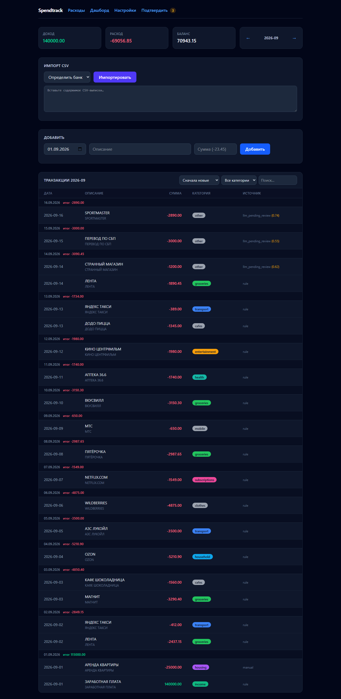
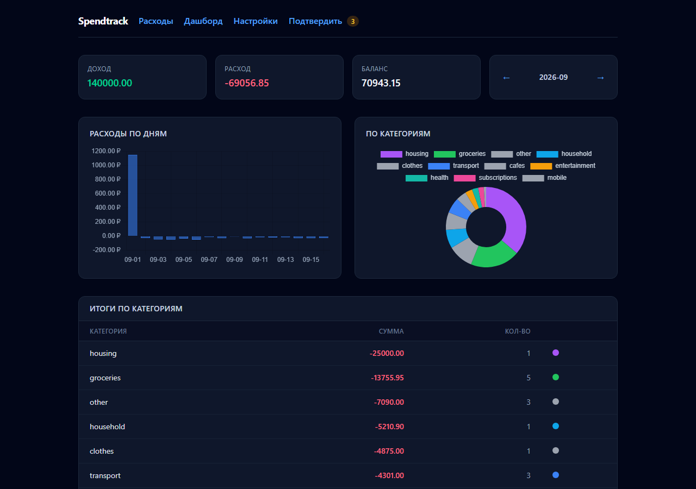
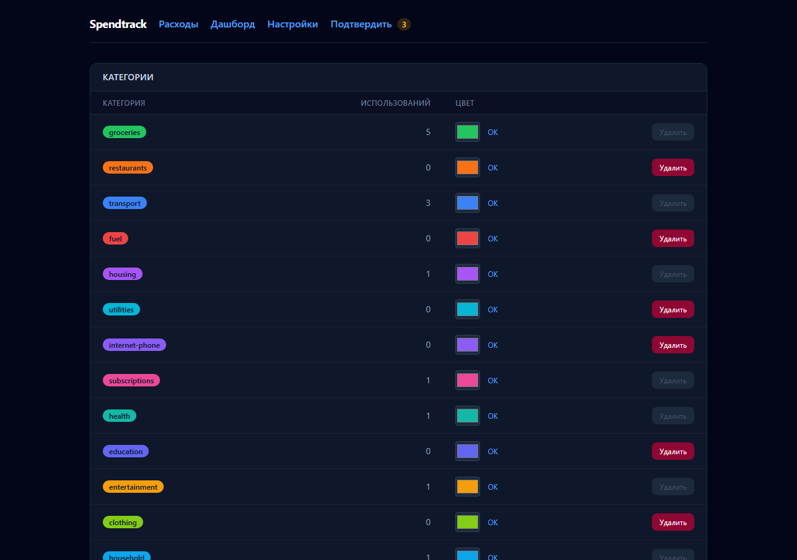

# Spendtrack

[](https://github.com/ExNihil14/spend-tracker/actions/workflows/ci.yml)
[](LICENSE)
[](https://codespaces.new/ExNihil14/spend-tracker)

Трекер личных расходов с LLM-категоризацией: детерминированное ядро (правила) закрывает большую часть транзакций,
LLM подключается только для остатка, спорное уходит в очередь ручного подтверждения. FastAPI + SQLite + htmx,
offline-first: без ключей и сети работает на правилах.



## Возможности

- **Импорт выписок** Сбера, Тинькофф и Яндекса с автоопределением формата; дедуп по fingerprint — повторный импорт ничего не добавляет.
- **Каскад категоризации:** кэш мерчантов → keyword-правила (first-match) → LLM → офлайн-правила. Автоприём при `confidence ≥ 0.9`, остальное — в очередь «Подтвердить».
- **Очередь подтверждения** с diff «предложение LLM / ваша категория»; одобренная правка учит кэш мерчантов и few-shot.
- **Управление таксономией в UI** (`/settings`): категории, правила с приоритетом (↑/↓), диагностика «мёртвых» и дублирующих правил, переименование категории с миграцией данных, тестер описаний.
- **Дашборд**: расходы по дням и категориям; фильтры и сортировки живут в URL.
- **CLI** для быстрых операций и калибровки порога авто-приёма по фактическим исходам.

## Быстрый старт

Нужны Python 3.13+ и [uv](https://docs.astral.sh/uv/).

```bash
git clone https://github.com/ExNihil14/spend-tracker.git
cd spend-tracker
uv sync
cp .env.example .env      # необязательно: ключи LLM (бесплатные :free модели)
```

Запуск:

```powershell
.\run.ps1                  # Windows: проверит порт и откроет браузер
```

```bash
uv run uvicorn spendtrack.main:app --host 127.0.0.1 --port 8766
```

Приложение: <http://127.0.0.1:8766> — БД создастся сама в `data/spend.db`.

## Тестирование в GitHub Codespaces

Прямая ссылка: [создать codespace](https://codespaces.new/ExNihil14/spend-tracker) (квота GitHub Free: 120 core-часов/мес).
Контейнер сам ставит `uv`, зависимости и запускает приложение на порту 8766; порт **приватный** — доступен только
после входа в GitHub (в приложении нет своей авторизации). Данные — **только синтетические**:

```bash
uv run python scripts/review_demo.py seed   # демо-строки для проверки очереди /approve
```

Открыть приложение: вкладка **PORTS** → порт 8766 → значок «Open in Browser».
Логи: `tail -f /tmp/spendtrack.log`. Кнопка e2e-тестов в облаке (опционально): `uv run playwright install --with-deps chromium`.

## Использование

- `/` — транзакции: импорт CSV, добавление, поиск, фильтры по месяцу и категории, сортировки, дневные итоги.
- `/dashboard` — графики и итоги по категориям.
- `/approve` — очередь подтверждения категорий.
- `/settings` — категории, правила, тестер описаний.



### CLI

```bash
uv run spendtrack add -23.45 "milk"           # добавить расход (категория — из каскада правил/LLM)
uv run spendtrack import statement.csv --bank auto
uv run spendtrack report --month 2026-09
uv run spendtrack count
uv run spendtrack confidence                  # калибровка порога авто-приёма (бакеты, покрытие, ошибки)
```

## Настройка

- `config/settings.toml` — порт, LLM-эндпоинты, порог авто-приёма (`acceptance.auto_accept_confidence`).
- `config/taxonomy.toml` — категории и keyword-правила (правятся и через `/settings`).
- Переменные окружения или `.env` в корне: `SPENDTRACK_OPENROUTER_API_KEY`, `SPENDTRACK_FREEL_LLM_API_KEY`, `SPENDTRACK_DB_PATH`
  (порт и LLM-эндпоинты задаются в `settings.toml`; окружение их не переопределяет).
- LLM не обязателен: без ключей категоризация работает на правилах, спорные строки ждут подтверждения.



## Разработка

```bash
uv run pytest              # unit-тесты (LLM всегда стаб, сеть не нужна)
uv run pytest -m e2e       # Playwright: реальный uvicorn на временном порту и временной БД
uv run ruff check src tests
```

- Суммы хранятся в копейках (`INTEGER`), БД — SQLite в WAL, миграции — по `PRAGMA user_version`.
- Архитектура и решения: [`spec/ARCHITECTURE.md`](spec/ARCHITECTURE.md) · контур верификации: [`spec/PIPELINE.md`](spec/PIPELINE.md) · стек и деплой: [`spec/stack.md`](spec/stack.md) · словарь: [`CONTEXT.md`](CONTEXT.md).
- Изменения: [`CHANGELOG.md`](CHANGELOG.md).

## Бэкап

```bash
uv run python scripts/backup.py --keep 14   # VACUUM INTO, безопасно при WAL
```

## Лицензия

MIT — см. [`LICENSE`](LICENSE).
